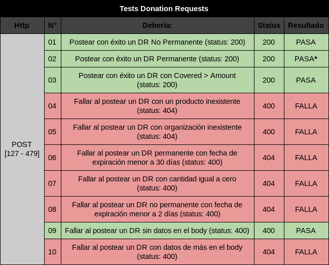
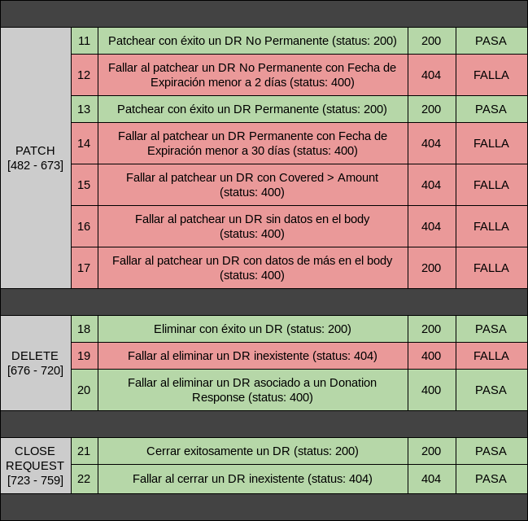
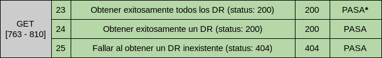
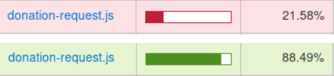
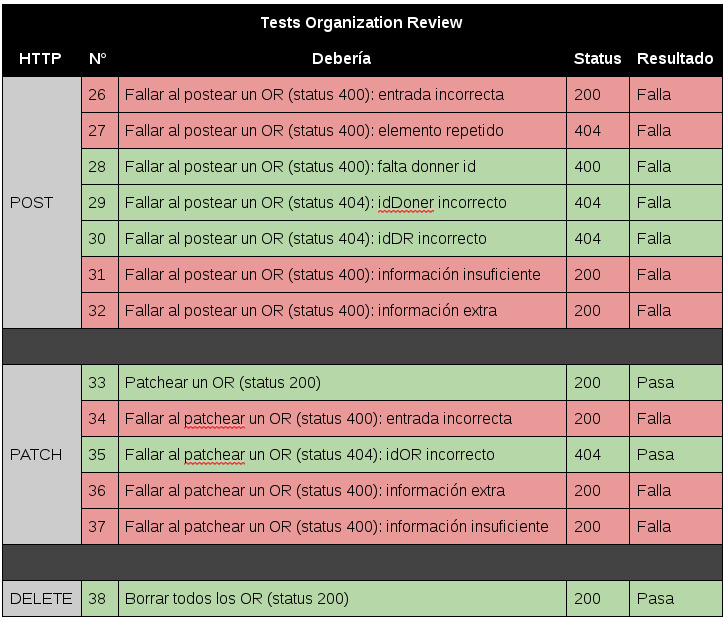
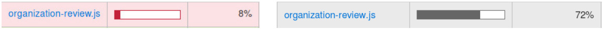
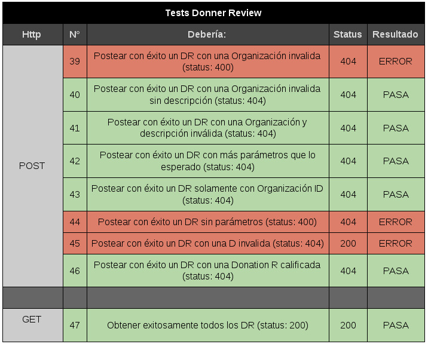
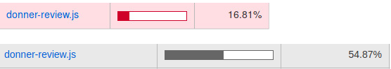

#Informe de Testing

##Verificación y Validación de Software

**Integrantes:**
* Gabriel Cancellieri
* Lucas Pérez
* Kevin Isaia

#Introducción
Como punto de partida para esta práctica se tomó el sistema de donaciones desarrollado por el voluntariado de la FAI, particularmente la api de este sistema web. En base a esto se escribieron distintas pruebas para 3 módulos que ya presentaban algunos tests, pero tenían una cobertura relativamente baja. Por lo tanto, se amplió el porcentaje de dicha cobertura al máximo posible y se logró detectar algunos fallos, errores y bugs.
El objetivo principal del presente informe es detallar los resultados arrojados por los test realizados sobre los módulos testeados de la API del sistema de gestión de donaciones que se desarrolla en el voluntariado de la FAI. A continuación se listan y describen las distintas herramientas utilizadas durante la práctica.

####Herramientas utilizadas
Primeramente, se ha utilizado la herramienta Mocha para realizar los tests sobre la API. Mocha es un framework de testing de JavaScript para programas hechos en Node.js, que cuenta con soporte de navegador, pruebas asincrónicas, informes de cobertura de prueba y el uso de cualquier biblioteca de aserciones. Las librerías utilizadas para llevar a cabo los tests mencionados a continuación son: chai, should y express.
También se utilizó el explorador de Loopback para realizar ciertas peticiones de pruebas antes de escribir los test.
Para verificar el cubrimiento de líneas de código testeadas se utilizó una herramienta llamada nyc coverage la cual funciona muy bién en conjunto con mocha y permite generar distintos tipos de salidas para analizar el cubrimiento.

####Referencias:
* Mocha: https://mochajs.org/
* nyc: https://github.com/istanbuljs/nyc  -  https://istanbul.js.org/ 
* Loopback: http://loopback.io/doc/

#Módulos testeados

###Donation Request
El archivo correspondiente a los tests del módulo Donation Requests se llama “905.DonationRequest”. Se definieron un total de 25 tests para este módulo. Los happy tests son test que esperan un resultado positivo del servidor (por lo general, con un status 200), en cambio, los tests de error son aquellos que esperan que el servidor o la API devuelva un error de petición (por lo general, con status 400). Seguidamente, se pueden ver los test ejecutados y sus resultados:





(*) Este tipo de test pasa porque se ha agregado un esquema nuevo (DonationRequestSchema2) para los Donation Request Permanentes, ya que al postearlos cambian de esquema debido a que algunos atributos se nulifican y dejan de cumplir con el esquema declarado.

A continuación se describen en detalle los test que han fallado:
* Los tests 4, 5 y 19 esperan un status 404 ya que se está tratando de guardar o eliminar un Donation Request inexistente o se trae un id de una Organización o un Producto inexistente. Los mismos fallan porque, en cambio, reciben un status 400.
* Los tests 6, 7, y 8 esperan un status 400 debido a que se está tratando de guardar un Donation Request con valores en sus atributos que no corresponden, por ejemplo, un donation request que cuya fecha de expiración no supera por dos días a la fecha de creación. En estos casos se suele responder con un status 400 porque la request no cumple con las condiciones necesarias para ser tomada por el servidor.
* Los tests 10, 12, 14, 15, 16 y 17 deberían traer un status 400 ya que son todas requests http que tienen error en los atributos, ya sea porque sus atributos tienen un valor no deseable, o no tienen la cantidad suficiente de atributos o la cantidad de atributos excede la cantidad de atributos requeridos. 

El porcentaje de cubrimiento de las líneas de código del módulo Donation Request con los tests originales, solo llegaba al 21%. Luego, con todos los tests descritos anteriormente, el cubrimiento alcanzó el 88% aproximadamente. Sin embargo, cabe aclarar, que no todos los tests están contemplados en el código, por ejemplo, los tests 10, 16 y 17 son tests donde la request http trae atributos de más o no los mínimos requeridos y, por lo tanto, esta misma debe considerarse automáticamente como una “bad request”, es decir una petición inválida.



El procedimiento de testing de caja blanca para el presente módulo se llevó a cabo de la siguiente manera. En primer lugar, se analizó el código del módulo Donation Request, identificando las secciones correspondientes a los distintos tipos de request http (post, patch, delete, etc). Luego, se evaluaron las entradas necesarias para cada una de las requests y las salidas esperadas para cada una de estas.

Por ejemplo, antes de cualquier test, se limpian los Donation Requests ya posteados:
```
chai.request(server)
      .delete('/api/DonationRequests')
```
Después, se procede a postear un Donation Request de un producto inexistente, para esto, se obtiene sólo una organización válida, y se ingresa un id de producto que seguramente no existe en la base de datos. Además, otras entradas importantes son la fecha de expiración que debe ser mínimo 2 días mayor a la fecha de creación (fecha actual) y la cantidad requerida para el Donation Request debe ser mayor a cero. Para el test mencionado anteriormente, al no ser un happy test, se espera un error con un status 404 ya que no debería encontrar un producto con el id ingresado. A continuación, se pueden ver las líneas de código del test descrito.

```
chai.request(server)
        .get('/api/Organizations')
        .end((err, org) => {
          chai.request(server).post('/api/DonationRequests')
            .send({
              // no importa que se manda, siempre va a tomar la fecha actual
              creationDate: '2018-04-12',
              amount: 10,
              expirationDate: '2100-04-25',
              isPermanent: false,
              covered: 0,
              promised: 0,
              isOpen: true,
              description: 'Leche',
              productId: 'asdasd',
              organizationId: org.body[0].id,
            })
            .end((err, res) => {
              res.body.should.be.a('object');
              res.should.have.status(404);
              done();
            });
        });
```

###Organization Review
Los test realizados a este módulo se listan en la siguiente tabla indicando su ubicación en líneas de código, el status que se obtiene y el resultado del test en base al status obtenido. Todos los test se encuentran en un archivo de test llamado 907.organizationReview.test.js



A continuación se proporcionan detalles de los test que produjeron una salida con mayor relevancia o gravedad.

* Para el test N° 26 se esperaba un fallo debido a que dos de los atributos enviados en la petición tienen datos incorrectos. El atributo “linked”, el cual es un boolean acepta un string, y el atributo “description” acepta una cadena vacía a pesar de ser un atributo requerido.
* En EL caso del test N° 27, falla debido a que se devuelve un status 404 para una petición que intenta postear dos elementos similares, es decir ítems repetidos. Por lo cual el estado 404 no es el apropiado para la respuesta.
* Para el test N° 31 se detectó un error similar a los mencionados en el inciso anterior, sólo que con un nivel de gravedad un poco más alto debido a que a pesar de que la petición contiene en su cuerpo solo los id que definen las relaciones con donner y donation request, esta es aceptada , por ende se postea un OR que no contiene ningún dato, ni siquiera los required.
* En el caso del test N° 32, la petición es aceptada a pesar de contener datos extra en ella. Debería arrojar un error de bad request ya que permitir peticiones de este tipo puede traer otro tipo de problemas tanto para el sistema como para desarrolladores. 
* Para los test N° 34, 36 y 37 sepresentan fallos similares a los de los incisos 26, 32 y 37 respectivamente, solo que en peticiones patch en vez de post. Además para el caso 37, la petición es enviada totalmente vacía y es aceptada.

El porcentaje de **cubrimiento** de líneas de código pasó del **8%** al **72%** luego de realizar estos test. Las líneas no testeadas del módulo son aquellas en la que se capturan errores de manera genérica, es decir, no capturan un error específico. Por lo cual resulta muy difícil poder escribir un test que las ejecute.



Durante la práctica se aplicó testing de caja blanca debiendo analizar el código del módulo verificando que líneas cubría cada test, e intentando generar el mayor cubrimiento posible, tanto de líneas, como de condiciones y bucles. Como se mencionó anteriormente, algunas líneas no son cubiertas ya que representan las capturas de errores genéricos, los cuales son muy difíciles de causar o simular.

**Por ejemplo**, para el test de postear un elemento repetido lo que se hace inicialmente es eliminar los OR posteados:

```
chai.request(server)
 .delete('/api/OrganizationReviews')
```
Luego se procedió a postear un OR y luego uno similar, es decir uno con mismo donnerId y donationRequestId, lo que debería arrojar error ya que según requerimientos no puede ser aceptado un OR que presente estas caracteristicas.

```
chai.request(server).post('/api/OrganizationReviews')
.send({
   liked: false,
   description: 'Descripcion del que si postea',
   donnerId: resGD.body[0].id,
   donationRequestId: resGD1.body[0].id,
 })
.end((err, resP) => {
   chai.request(server).post('/api/OrganizationReviews')    
.send({
       liked: true,
       description: 'Descripcion del que falla x repetido',
       donnerId: resGD.body[0].id,
       donationRequestId: resGD1.body[0].id,
     })
     .end((err, res) => {
       res.body.should.be.a('object');
       res.should.have.status(400);
       done();
     });
 });
```
Luego, como se esperaba, el error obtenido como respuesta fué Bad Request (400).

###Donner Review
Los test realizados se listan en la siguiente tabla indicando su ubicación y tipo:



El porcentaje de **cubrimiento** de líneas de código pasó del **10%** al **54.87%** luego de realizar los test representados en la tabla. Varias líneas no testeadas del módulo son aquellas en la no capturan un error específico. Por lo cual resulta muy difícil poder escribir un test que las ejecute. 
La mayoría de los test que se realizaron en la parte de “Donner Review” dieron lo que esperaba, ya que al saber del dominio y las especificaciones, se trató de corromper haciendo inserciones como por ejemplo, postear con éxito una donner sin parámetros.

39) Devuelve un 404 cuando en realidad esperaba un 400, se intentó insertar una una Donner Review con una organization inválida.

44) Devuelve 404 y se esperaba un 400, se intentó postear una Donner Revire sin parámetros.

45) Se logró postear con éxito un Donner Review, con una donation Inválida. Esperaba un 404 y salió status 200.



Las técnicas de testing de caja blanca son aplicadas por ejemplo las líneas en un método de tipo POST ubicado entre las líneas [213-219], se observó como entrada los parámetros requeridos:
```
-   'liked'.   type: 'boolean'.
-  'description'.  type: 'string'.
-  'organizationId'.  type: 'string'.
-  'donationResponseId'.  type: 'string'.
```
Sabiendo que se esperaba como resultado:
``` 
res.should.have.status(404)
```
Se tomó el caso de insertar una organizationId’ erróneo; citando el ejemplo:
```
organizationId: "asdsadasdsasa".
```
Correctamente muestra una salida de status 404.

#Conclusión
Gracias a la realización de esta práctica se pudieron detectar varios fallos en los módulos estudiados, de los cuales muchas eran similares. Aunque las fallas y errores detectados no se consideran de alto nivel de criticidad, estas pueden ser perjudiciales en determinados aspectos como por ejemplo la legibilidad y modificabilidad que tendrá el sistema. Se recomienda utilizar los códigos http correspondientes para cada tipo de respuesta.
